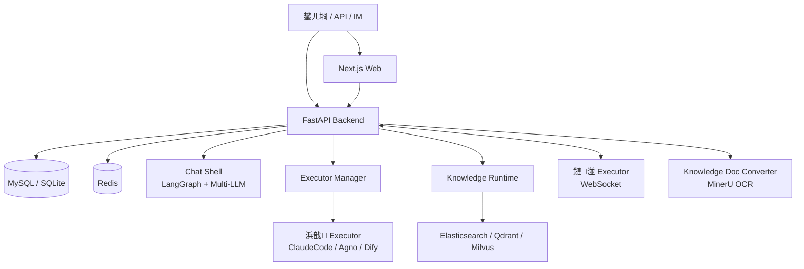

# Wegent

> 鍙嚜閮ㄧ讲鐨?AI 宸ヤ綔鍙帮細鎶婂璇濄€佷唬鐮併€佺煡璇嗗簱銆佽嚜鍔ㄥ寲鍜屾湰鍦版墽琛屾斁鍒颁竴涓叆鍙ｉ噷銆?
[English](README.md) | 绠€浣撲腑鏂?
[](https://python.org)
[](https://fastapi.tiangolo.com)
[](https://nextjs.org)
[](https://docker.com)
[](https://claude.ai)
[](https://ai.google.dev)
[](https://github.com/wecode-ai/wegent/releases)

<div align="center">

[蹇€熷紑濮媇(#-蹇€熷紑濮? 路 [鏍稿績鍦烘櫙](#鏍稿績鍦烘櫙) 路 [宸ヤ綔鏂瑰紡](#宸ヤ綔鏂瑰紡) 路 [鏂囨。](https://wecode-ai.github.io/wegent-docs/zh/) 路 [寮€鍙戞寚鍗梋(https://wecode-ai.github.io/wegent-docs/zh/docs/category/developer-guide)

</div>

---

## 涓轰粈涔堥€夋嫨 Wegent

Wegent 鏄竴涓彲鑷儴缃茬殑 AI 宸ヤ綔鍙帮紝鐢ㄦ潵缁熶竴绠＄悊瀵硅瘽銆佷唬鐮佷换鍔°€佺煡璇嗗簱銆佽嚜鍔ㄥ寲鍜屾湰鍦版墽琛屻€備綘鍙互鎶婅祫鏂欐斁杩涚煡璇嗗簱鐩存帴鎻愰棶锛屾妸浠ｇ爜浠撳簱浜ょ粰 AI 澶勭悊锛屾妸姣忓ぉ瑕佸叧娉ㄧ殑淇℃伅鍋氭垚鑷姩杩借釜锛屼篃鍙互璁╁洟闃熷湪閽夐拤銆乀elegram 閲岃皟鐢ㄥ悓涓€鎵瑰姪鎵嬨€傞渶瑕佽闂湰鏈轰粨搴撴垨鍐呯綉璧勬簮鏃讹紝浠诲姟杩樿兘璺戝湪鑷繁鐨勭數鑴戜笂銆?
- **涓汉鍙揩閫熷紑濮?*锛氫竴鏉″懡浠ゅ惎鍔ㄧ鏈夊伐浣滃彴锛屽厛鐢ㄥ璇濆拰鐭ヨ瘑搴撹В鍐虫棩甯搁棶棰樸€?- **鍥㈤槦鍙€愭娌夋穩**锛氬父鐢ㄥ姪鎵嬨€佹ā鍨嬨€佸伐鍏峰拰鐭ヨ瘑搴撳彲浠ュ叡浜紝閬垮厤姣忎釜浜洪噸澶嶉厤缃€?- **浠诲姟涓嶈闄愬埗鍦ㄤ簯绔?*锛氫唬鐮佷换鍔°€佽嚜鍔ㄥ寲浠诲姟鍜屾湰鍦版墽琛屽彲浠ユ寜鍦烘櫙閫夋嫨杩愯浣嶇疆銆?- **瀹规槗鎺ヨ繘鐜版湁娴佺▼**锛氶€氳繃 API 鎴?IM 鏈哄櫒浜猴紝鎶?AI 鏀惧埌宸茬粡鍦ㄧ敤鐨勫伐鍏烽噷銆?
---

## 馃殌 蹇€熷紑濮?
鍓嶇疆瑕佹眰锛氬凡瀹夎 Docker 鍜?Docker Compose銆?
```bash
curl -fsSL https://raw.githubusercontent.com/wecode-ai/Wegent/main/install.sh | bash
```

鍚姩鍚庤闂?http://localhost:3000銆?
### 閮ㄧ讲妯″紡

| 妯″紡 | 閫傚悎鍦烘櫙 |
|------|----------|
| **Standalone**锛堥粯璁わ級 | 鍗曞鍣?+ SQLite锛岄€傚悎涓汉璇曠敤鍜岃交閲忛儴缃?|
| **Standard** | 澶氬鍣?+ MySQL + Redis锛岄€傚悎鍥㈤槦鍜岀敓浜х幆澧?|
| **Development** | 婧愮爜鍚姩 + 鐑噸杞斤紝閫傚悎寮€鍙戝拰浜屾鎵╁睍 |

```bash
# Standard 妯″紡
curl -fsSL https://raw.githubusercontent.com/wecode-ai/Wegent/main/install.sh | bash -s -- --standard

# 寮€鍙戞ā寮?git clone https://github.com/wecode-ai/Wegent.git && cd Wegent && ./start.sh
```

<details>
<summary><b>甯哥敤鍛戒护</b></summary>

```bash
# Standalone 妯″紡
docker logs -f wegent-standalone
docker restart wegent-standalone

# Standard 妯″紡
docker compose logs -f
docker compose down
docker compose up -d

# 寮€鍙戞ā寮?./start.sh --status
./start.sh --restart
./start.sh --stop
```

</details>

> 璇︾粏閮ㄧ讲璇存槑瑙?[Standalone 妯″紡鏂囨。](docs/zh/deployment/standalone-mode.md) 鍜?[蹇€熷紑濮嬫枃妗(docs/zh/getting-started/quick-start.md)銆?
---

## 鏍稿績鍦烘櫙

### 瀵硅瘽銆佺兢鑱婁笌鏂囦欢澶勭悊


鎼缓涓€涓彲绉佹湁鍖栫殑 AI 瀵硅瘽鍏ュ彛銆傚畠鏀寔澶氭ā鍨嬨€佸杞巻鍙层€佺兢鑱?@ 鎻愬強銆佹枃浠惰В鏋愩€佽拷闂緞娓呫€佸洖绛旀牎楠屽拰闀挎湡璁板繂銆傞渶瑕佹椂锛孉I 涔熷彲浠ヨ鍙栨枃浠躲€佹墽琛屽懡浠ゆ垨鐢熸垚鍥捐〃銆?
### 璁?AI 澶勭悊浠ｇ爜浠撳簱


璁?AI 鍦ㄩ殧绂荤幆澧冧腑澶勭悊浠ｇ爜浠诲姟銆俉egent 鍙互杩炴帴 GitHub銆丟itLab銆丟itea銆丟errit锛屽畬鎴愰渶姹傛緞娓呫€佸垎鏀垱寤恒€佷唬鐮佷慨鏀广€佹祴璇曘€佹彁浜ゅ拰 PR 鍒涘缓绛夋祦绋嬨€?
### 鑷姩杩借釜淇℃伅骞剁敓鎴愪俊鎭祦


鎶?AI 鍙樻垚鎸佺画杩愯鐨勪换鍔¤Е鍙戝櫒銆備綘鍙互璁剧疆瀹氭椂瑙勫垯鎴栦簨浠惰Е鍙戯紝璁?AI 瀹氭湡姹囨€讳俊鎭€佸垎鏋愮綉椤点€佺瓫閫夐€氱煡锛屽苟鎶婄粨鏋滄矇娣€涓轰俊鎭祦銆?
### 鐭ヨ瘑搴撻棶绛?


涓婁紶鏂囨。銆佸鍏ョ綉椤垫垨鍚屾閽夐拤澶氱淮琛紝鏋勫缓鍥㈤槦鐭ヨ瘑搴撱€俉egent 浼氳礋璐ｈВ鏋愩€佽浆鎹€佺储寮曞拰妫€绱紝璁?AI 鍦ㄥ洖绛旀椂寮曠敤浣犵殑璧勬枡銆?
### 鏈湴璁惧鎵ц


鍦ㄨ嚜宸辩殑鐢佃剳涓婂畨瑁呮湰鍦版墽琛岀▼搴忥紝骞跺畨鍏ㄨ繛鎺ュ埌 Wegent銆備换鍔″彲浠ュ湪浜戠闅旂鐜鍜屾湰鍦拌澶囦箣闂村垏鎹紝閫傚悎闇€瑕佽闂湰鏈轰粨搴撱€佸唴缃戣祫婧愭垨涓撳睘寮€鍙戠幆澧冪殑鍦烘櫙銆?
### 鎺ュ叆鍥㈤槦娌熼€氬伐鍏峰拰宸叉湁绯荤粺

鎶?Wegent 鏅鸿兘浣撴帴鍏ラ拤閽夈€乀elegram 绛?IM 宸ュ叿锛屼篃鍙互閫氳繃 API 鎺ュ叆宸叉湁搴旂敤锛岃鍥㈤槦鍦ㄥ師鏉ョ殑宸ヤ綔娴侀噷鐩存帴璋冪敤 AI銆?
---

## 浠庣畝鍗曞紑濮嬶紝鍐嶉€愭鎵╁睍

浣犱笉闇€瑕佷竴寮€濮嬪氨鐞嗚В鎵€鏈夋蹇点€俉egent 鍙互鍏堝綋浣滀竴涓鏈?AI 宸ヤ綔鍙颁娇鐢細閫夋ā鍨嬨€佸垱寤哄姪鎵嬨€佷笂浼犺祫鏂欍€佸紑濮嬪璇濄€傜瓑鍥㈤槦寮€濮嬪鐢ㄨ繖浜涜兘鍔涙椂锛屽啀閫愭鎶婂父鐢ㄥ姪鎵嬨€佺煡璇嗗簱銆佷唬鐮佷换鍔″拰 IM 鍏ュ彛娌夋穩涓嬫潵銆?
| 闃舵 | 浣犲彲浠ユ€庝箞鐢?|
|------|--------------|
| **涓汉浣跨敤** | 蹇€熷惎鍔ㄦ湇鍔★紝鍒涘缓鑷繁鐨?AI 鍔╂墜鍜岀煡璇嗗簱 |
| **鍥㈤槦鍗忎綔** | 鍏变韩甯哥敤鍔╂墜銆佹ā鍨嬮厤缃€佺煡璇嗗簱鍜屼唬鐮佷换鍔?|
| **鑷姩鍖栧伐浣滄祦** | 鐢ㄥ畾鏃朵换鍔°€佷簨浠惰Е鍙戞垨 IM 鏈哄櫒浜鸿 AI 涓诲姩澶勭悊宸ヤ綔 |
| **娣卞害闆嗘垚** | 閫氳繃 API銆佸伐鍏锋墿灞曞拰閰嶇疆鏂囦欢鎺ュ叆宸叉湁绯荤粺 |

<details>
<summary><b>鏍稿績姒傚康锛堢粰闇€瑕佽嚜瀹氫箟鍜屾墿灞曠殑浜猴級</b></summary>

Wegent 鍐呴儴鎶婁竴涓?AI 鍔╂墜鎷嗘垚鍑犲潡鍙鐢ㄩ厤缃細

```text
Ghost锛堟彁绀鸿瘝 + MCP + Skills锛?  + Shell锛圕hat / ClaudeCode / Agno / Dify锛?  + Model锛圕laude / OpenAI / Gemini / DeepSeek / GLM 绛夛級
  = Bot锛堟満鍣ㄤ汉锛?
澶氫釜 Bot + 鍗忎綔妯″紡 = Team锛堢敤鎴风湅鍒扮殑鏅鸿兘浣擄級
Team + Workspace = Task锛堜竴娆″彲杩借釜鐨勬墽琛岋級
```

杩欎簺鍏崇郴鍙互閫氳繃 Web UI 鍒涘缓锛屼篃鍙互鐢?YAML 绠＄悊銆俉eb UI 閲岀殑鍒涘缓鍚戝鏀寔鈥滄弿杩伴渶姹?鈫?AI 杩介棶 鈫?瀹炴椂寰皟 鈫?涓€閿垱寤衡€濄€?
</details>

---

## 閮ㄧ讲鍜屾帴鍏?
Wegent 鍙互浠庝釜浜鸿瘯鐢ㄩ€愭鎵╁睍鍒板洟闃熼儴缃诧細

- **涓汉璇曠敤**锛歋tandalone 妯″紡鍗曞鍣ㄥ惎鍔紝閫傚悎鏈満鎴栬交閲忔湇鍔″櫒銆?- **鍥㈤槦閮ㄧ讲**锛歋tandard 妯″紡浣跨敤鐙珛鏁版嵁搴撱€佺紦瀛樺拰鎵ц鏈嶅姟锛岄€傚悎闀挎湡杩愯銆?- **鏈湴璁惧**锛氭妸鑷繁鐨勭數鑴戞帴鍏ヤ负鎵ц鐜锛屽鐞嗛渶瑕佹湰鏈轰粨搴撴垨鍐呯綉璧勬簮鐨勪换鍔°€?- **宸叉湁绯荤粺**锛氶€氳繃 API 鎴?IM 鏈哄櫒浜猴紝鎶?Wegent 鎺ュ埌鍥㈤槦鐜版湁宸ュ叿閲屻€?
<details>
<summary><b>鎶€鏈粍浠舵瑙?/b></summary>



</details>

---

## 缁欏紑鍙戣€呭拰鍥㈤槦绠＄悊鍛?
- **鎺ュ叆鑷繁鐨勫簲鐢?*锛氶€氳繃 `/api/v1/responses` 璋冪敤 Wegent 涓殑鏅鸿兘浣撱€?- **杩炴帴澶栭儴宸ュ叿**锛氶€氳繃 MCP 璁?AI 璋冪敤宸叉湁宸ュ叿鍜屾湇鍔°€?- **澶嶇敤澶嶆潅鑳藉姏**锛氭妸鐗瑰畾鑳藉姏鎵撳寘鎴?Skill锛岄渶瑕佹椂鍐嶅姞杞姐€?- **閫夋嫨閫傚悎鐨勮繍琛屾柟寮?*锛氬璇濄€佷唬鐮佷换鍔°€佸鏅鸿兘浣撳崗浣滃拰澶栭儴搴旂敤浠ｇ悊鍙互鍒嗗埆浣跨敤涓嶅悓杩愯寮曟搸銆?- **缁熶竴绠＄悊妯″瀷**锛氭敮鎸?OpenAI銆丆laude銆丟emini銆丏eepSeek銆丟LM 浠ュ強鍏煎鍗忚鐨勬ā鍨嬫湇鍔°€?- **鍥㈤槦鍏变韩鍜屾潈闄?*锛氭敮鎸佺粍缁囥€佸叡浜櫤鑳戒綋銆佸叡浜ā鍨嬨€佸叡浜?Skills 鍜岀鐞嗗悗鍙般€?- **鍙娴嬫€?*锛氬悗绔€佸墠绔拰鎵ц鏈嶅姟鏀寔 OpenTelemetry 閰嶇疆銆?
---

## 棰勭疆鍔╂墜

| 鍔╂墜 | 鐢ㄩ€?|
|------|------|
| `chat-team` | 閫氱敤 AI 鍔╂墜锛屾敮鎸?Mermaid 鍥捐〃 |
| `translator` | 澶氳瑷€缈昏瘧 |
| `dev-team` | Git 宸ヤ綔娴侊細鍒嗘敮銆佺紪鐮併€佹彁浜ゃ€丳R |
| `wiki-team` | 浠ｇ爜搴?Wiki 鏂囨。鐢熸垚 |

---

## 鏂囨。

- [蹇€熷紑濮媇(docs/zh/getting-started/quick-start.md)
- [瀹夎鎸囧崡](docs/zh/getting-started/installation.md)
- [鏍稿績姒傚康](docs/zh/concepts/core-concepts.md)
- [Skill 绯荤粺](docs/zh/concepts/skill-system.md)
- [YAML 瑙勮寖](docs/zh/reference/yaml-specification.md)
- [OpenAPI Responses API](docs/zh/reference/openapi-responses-api.md)
- [寮€鍙戞寚鍗梋(docs/zh/developer-guide/README.md)

---

## 璐＄尞

鎴戜滑娆㈣繋璐＄尞锛佽鎯呰鍙傞槄 [璐＄尞鎸囧崡](CONTRIBUTING.md)銆?
## 鏀寔

- 馃悰 闂鍙嶉锛歔GitHub Issues](https://github.com/wecode-ai/wegent/issues)
- 馃挰 Discord锛歔鍔犲叆绀惧尯](https://discord.gg/MVzJzyqEUp)

## 璐＄尞鑰?
鎰熻阿浠ヤ笅寮€鍙戣€呯殑璐＄尞锛岃杩欎釜椤圭洰鍙樺緱鏇村ソ 馃挭

<!-- readme: contributors -start -->
<table>
<tr>
    <td align="center">
        <a href="https://github.com/qdaxb">
            
            <br />
            <sub><b>Axb</b></sub>
        </a>
    </td>
    <td align="center">
        <a href="https://github.com/Micro66">
            
            <br />
            <sub><b>MicroLee</b></sub>
        </a>
    </td>
    <td align="center">
        <a href="https://github.com/feifei325">
            
            <br />
            <sub><b>Feifei</b></sub>
        </a>
    </td>
    <td align="center">
        <a href="https://github.com/FicoHu">
            
            <br />
            <sub><b>FicoHu</b></sub>
        </a>
    </td>
    <td align="center">
        <a href="https://github.com/cc-yafei">
            
            <br />
            <sub><b>YaFei Liu</b></sub>
        </a>
    </td>
    <td align="center">
        <a href="https://github.com/kissghosts">
            
            <br />
            <sub><b>Yanhe</b></sub>
        </a>
    </td>
    <td align="center">
        <a href="https://github.com/icycrystal4">
            
            <br />
            <sub><b>Icycrystal4</b></sub>
        </a>
    </td>
    <td align="center">
        <a href="https://github.com/parabala">
            
            <br />
            <sub><b>Parabala</b></sub>
        </a>
    </td></tr>
<tr>
    <td align="center">
        <a href="https://github.com/johnny0120">
            
            <br />
            <sub><b>Johnny0120</b></sub>
        </a>
    </td>
    <td align="center">
        <a href="https://github.com/moqimoqidea">
            
            <br />
            <sub><b>Moqimoqidea</b></sub>
        </a>
    </td>
    <td align="center">
        <a href="https://github.com/yixiangxx">
            
            <br />
            <sub><b>Yi Xiang</b></sub>
        </a>
    </td>
    <td align="center">
        <a href="https://github.com/joyway1978">
            
            <br />
            <sub><b>Joyway78</b></sub>
        </a>
    </td>
    <td align="center">
        <a href="https://github.com/sunnights">
            
            <br />
            <sub><b>Jake Zhang</b></sub>
        </a>
    </td>
    <td align="center">
        <a href="https://github.com/2561056571">
            
            <br />
            <sub><b>Xuemin</b></sub>
        </a>
    </td>
    <td align="center">
        <a href="https://github.com/cocowh">
            
            <br />
            <sub><b>Birch</b></sub>
        </a>
    </td>
    <td align="center">
        <a href="https://github.com/fengkuizhi">
            
            <br />
            <sub><b>Fengkuizhi</b></sub>
        </a>
    </td></tr>
<tr>
    <td align="center">
        <a href="https://github.com/kerwin612">
            
            <br />
            <sub><b>Kerwin Bryant</b></sub>
        </a>
    </td>
    <td align="center">
        <a href="https://github.com/RockysGit">
            
            <br />
            <sub><b>RockysGit</b></sub>
        </a>
    </td>
    <td align="center">
        <a href="https://github.com/maquan0927">
            
            <br />
            <sub><b>Just Quan</b></sub>
        </a>
    </td>
    <td align="center">
        <a href="https://github.com/junbaor">
            
            <br />
            <sub><b>Junbaor</b></sub>
        </a>
    </td>
    <td align="center">
        <a href="https://github.com/jnhu76">
            
            <br />
            <sub><b>Jm.hu</b></sub>
        </a>
    </td>
    <td align="center">
        <a href="https://github.com/fingki">
            
            <br />
            <sub><b>Fingki</b></sub>
        </a>
    </td>
    <td align="center">
        <a href="https://github.com/DavidLeeUX">
            
            <br />
            <sub><b>Kva</b></sub>
        </a>
    </td>
    <td align="center">
        <a href="https://github.com/flyhope">
            
            <br />
            <sub><b>鏉庢灗鐓?/b></sub>
        </a>
    </td></tr>
<tr>
    <td align="center">
        <a href="https://github.com/jolestar">
            
            <br />
            <sub><b>Jolestar</b></sub>
        </a>
    </td>
    <td align="center">
        <a href="https://github.com/code-wangdi">
            
            <br />
            <sub><b>Code-wangdi</b></sub>
        </a>
    </td>
    <td align="center">
        <a href="https://github.com/haosenwang1018">
            
            <br />
            <sub><b>Sense_wang</b></sub>
        </a>
    </td>
    <td align="center">
        <a href="https://github.com/LiDaiyan">
            
            <br />
            <sub><b>Li Daiyan</b></sub>
        </a>
    </td>
    <td align="center">
        <a href="https://github.com/qwertyerge">
            
            <br />
            <sub><b>Erdawang</b></sub>
        </a>
    </td>
    <td align="center">
        <a href="https://github.com/DeadLion">
            
            <br />
            <sub><b>Jasper Zhong</b></sub>
        </a>
    </td>
    <td align="center">
        <a href="https://github.com/rayzhang0603">
            
            <br />
            <sub><b>Ray</b></sub>
        </a>
    </td>
    <td align="center">
        <a href="https://github.com/RichardoMrMu">
            
            <br />
            <sub><b>RichardoMu</b></sub>
        </a>
    </td></tr>
<tr>
    <td align="center">
        <a href="https://github.com/Ged0">
            
            <br />
            <sub><b>_</b></sub>
        </a>
    </td>
    <td align="center">
        <a href="https://github.com/andrewzq777">
            
            <br />
            <sub><b>Andrewzq777</b></sub>
        </a>
    </td>
    <td align="center">
        <a href="https://github.com/ch15084">
            
            <br />
            <sub><b>Ch15084</b></sub>
        </a>
    </td>
    <td align="center">
        <a href="https://github.com/gdouyang">
            
            <br />
            <sub><b>Gdouyang</b></sub>
        </a>
    </td>
    <td align="center">
        <a href="https://github.com/graindt">
            
            <br />
            <sub><b>Graindt</b></sub>
        </a>
    </td>
    <td align="center">
        <a href="https://github.com/qingchengliu">
            
            <br />
            <sub><b>Qingcheng</b></sub>
        </a>
    </td>
    <td align="center">
        <a href="https://github.com/salt-hai">
            
            <br />
            <sub><b>Salt-hai</b></sub>
        </a>
    </td>
    <td align="center">
        <a href="https://github.com/wxcfox">
            
            <br />
            <sub><b>Wxcfox</b></sub>
        </a>
    </td></tr>
</table>
<!-- readme: contributors -end -->

---

<p align="center">鐢?WeCode-AI 鍥㈤槦鐢?鉂わ笍 鍒朵綔</p>
